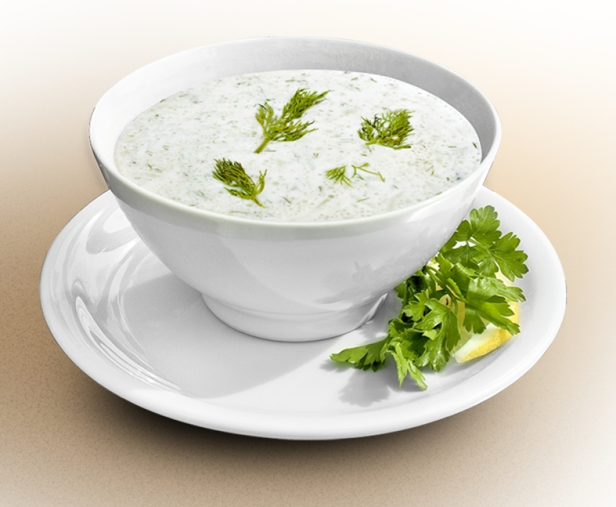

# Template Method

* _Описание:_
      Template Method задава скелета за алгоритъма на дадена операция, като оставя някои стъпки да бъдат дефинирани от подкласа.
      Всеки подклас сам дефинира съответните стъпки, без да променя цялостната структура на алгоритъма.
      
* _Връзки с други patterns:_
      Template Method променя логиката на цял клас, докато Strategy променя логиката на индивидуални обекти.
      Template Method използва наследяване, за да променя част от алгоритъма. Strategy използва делегаки, за да промени целия алгоритъм.

* _Приложение:_
      Когато искаме да направим един алгоритъм по-гъвкав и различен, без да се налага да пишем нов такъв за всяка малка промяна в него. 
      
* _Имплементация:_
      Примера разглежда приготвяне на таратор. Традиционно българско ястие.
      Краставицата може да се приготви по различни начини - нарязана на едро, на ситно, настъргана.

