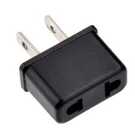

# Adapter

* _Описание:_
      Adapter е pattern, който прехвърля интерфейс от един клас върху друг. Така 2 класа, които по принцип са
      несъвместими, могат да работят заедно.
      Adapter е известен още и като Wrapper, Translator.
      

* _Връзки с други patterns:_
      Facade е близък до Adapter по замисъл. Разликата е, че Facade създава нов интерфейс, с който
      обединява сложни операции в една. Adapter прехвърля функционалност от един клас,
      който не може директно да се ползва, на друг. 

* _Проблеми:_
      Създава се coupling между класовете тип "Adapter" и "Adaptee". Т.е. този, който създаваме и този, който преработваме
      за нашите нужди.
      
* _Приложение:_
      Когато искаме да използваме функционалност от друга библиотека(примерно), но е несъвместима с нашата система.
      
* _Имплементация:_
      Предоставеният пример разглежда 2 класа USPlug и EPlug. Първият наследява интерфейс ITarget и чрез него
      получаваме достъп до EPlug. Или казано по-просто и образно - поставяме накрайник с европейски стандарт
      на щепсел с американски стандарт.

